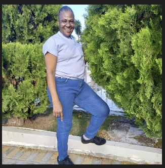

# My Immediate Challenges

My girlfriend Subrina Reid, bless her heart, is a shining example of a trauma survivor—just like me! Hailing from Jamaica, she’s managed to collect the full set of mental health issues in her starter pack: split personality, schizophrenia, bipolar disorder, and, of course, paranoia. Truly, her childhood was a generous gift from her loving family.

Apparently, the universe thinks that enduring sexual abuse by your father and brother is the fast track to an interesting clinical profile. Who knew?

Now, as I juggle my oh-so-simple corporate transition (because dreamy capitalism never stresses anyone out), Subrina decides to upstage the whole process—getting so stressed that concentrating on my stressed-out customers became something of an Olympic sport.

It’s not easy to focus on customer “pain points” when your girlfriend has decided, AGAIN, that eating is overrated, fainting in front of my trainer is performance art, and knocking on the neighbour’s door in her underwear at 5:30am is just another quirky morning ritual.

Let’s be real: survivors of severe trauma have the most inconvenient emotional responses. You’d almost think it was about them or something! Society has evolved a truly creative set of supportive clichés for these moments:

```
I hope she gets the help she needs!
```

Which, translated from polite society-speak, actually means:

```
Wow, can’t someone just sedate this disaster and lock her up
already? Maybe pump her so full of meds she’ll be too drooly
to make us uncomfortable at brunch?
```

Because, really, nothing says “I care” quite like hoping someone’s mental health problems can be solved by disappearing them out of sight.

I was overwhelmed.  At the time I didn't have a facility to generate
license codes for my customers nor a [clear way to communicate to my
customers](/why/hubspot.md). 


# I Asked Her Family to Help Keep Her Safe

One of the hardest things for me to accept is that I asked Subrina's own family for help.

When I realized she was vulnerable, I believed that the people who loved her would want to protect her. I spoke with her sister, Daniel Alexander, who suggested that the best thing would be for Subrina to spend some time with her mother, Chevan Reid.

Looking back, I believe that was a terrible mistake.

Since then, Subrina has told me that she wants to leave and return, but according to what she has communicated to me, she has not been able to do so. I feel an overwhelming sense of guilt because I helped put her back into an environment that I now believe is unsafe.

This is the only recent photograph I have of her mother. WhatsApp prevented me from saving it directly on my phone, so I captured it using the desktop application.



## Why I Am So Concerned

This is not simply a disagreement between family members.

My concern is that vulnerable people can become trapped in situations where abuse is normalized and where the people who should be protecting them instead become part of the problem. When that happens, victims often have nowhere to turn.

If what Subrina has told me is true, then she deserves to be heard, believed, and given the opportunity to leave freely and safely.

## My Perspective

These events have forced me to reflect on my own family history.

I grew up seeing the long-term consequences that sexual abuse and trauma can have on people's lives. In my experience, the deepest wounds are often carried by the victims, while the people responsible frequently avoid meaningful accountability.

That has shaped the way I think about these issues. I believe survivors need safety, honest conversations, and practical support. They deserve people who are willing to listen rather than dismiss their experiences.

## Why I Am Speaking Publicly

I did not arrive at this point lightly.

My first instinct was to resolve these concerns privately and through ordinary channels. I hoped that family members would act responsibly and that the situation could be resolved without public attention.

Instead, I have found myself feeling increasingly powerless.

This document is my attempt to explain why I am so deeply concerned and why I believe vulnerable adults deserve every opportunity to leave situations they experience as unsafe.

If I have made mistakes, one of the biggest was believing that asking family members for help would necessarily make Subrina safer.

That is something I will have to live with.

My hope now is simply that she is able to make her own decisions freely, without fear or coercion, and that she has access to whatever support she chooses. 

But this is not what is happening.  She doesn't have access to her phone nor her passport.

The last time I saw her her in person was on July 7th when I took her to the Montego Bay in Jamaica.

I didn't meet her mother then because my flight back was within half an hour.  I did not realize that there is no way the sexual abuse could have happened without her mother being aware.  Good mothers recognize that all young women are vulnerable to predators and they make sure that their daughters are protected.

## Contact Details

Her sister Daniel Alexander (Whatsapp +1 345 525-1991)  
Her mother Chevan Reid (Whatsapp +1 876 419 5293)  
Her brother Kwaine Reid (Whatsapp +1 345 548 9110)  
Kwaine lives on the island and works in one of the restaurants in Camana Bay.
