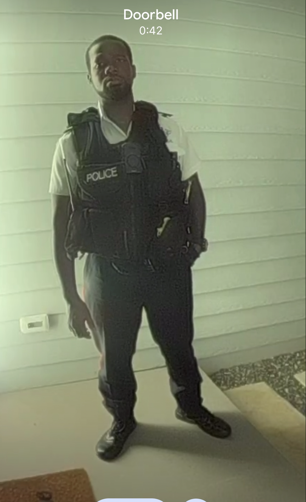

# Officer Price, Badge 826

Meet **Officer Price, Badge 826**. His arrival at my door reminded me of the time Subrina and I staged a playful photo shoot with ketchup and power tools—thankfully, the only real casualty was the ketchup (which, let’s face it, is better left on fries than in a crime scene, especially given all that processed sugar!).

We sent our silly handiwork to my friend George Karahotkis, and, as you’d expect, the next day I had a visit from three members of our dedicated police force.

I’ve always been fascinated by the inner workings of the police department, especially when it comes to how complex situations can sometimes trip up even the best-intentioned officers. As it happens, I actually know quite a few people in law enforcement. Officer Price could easily connect with Mikhail, [a fellow member of my film community](movie.md)! Despite the challenges, I appreciated that Officer Price made the effort to reach out to my friend Gerald Watts. I know Gerald from our time acting together in *Cinderella*—which is also how I met Reshma Sharma, now Solicitor General of the Cayman Islands. In such a small community, it sometimes feels like everyone is linked to everyone else.

I still wish that Officer Price showed a bit more enthusiasm for investigating what happened to Subrina, but perhaps these things are more complicated behind the scenes than I realize.

Gerald said he’d be in touch with Officer Price on Friday, though it was rather late, and Gerald seems to respect Officer Price’s boundaries much more diligently than he does mine—he’s rather developed a habit of appearing at my house at the oddest hours!

**Officer Price, Badge 826**—whose full name I never quite caught—seemed very focused on upholding protocol, and sometimes the approach is a reminder that the law’s priorities might not always line up with the expectations of the community, especially in sensitive situations. My cousin Tim once worked as a prison officer, specifically dealing with the care of sex offenders, and it's eye-opening to see how many layers there are to protecting people in our justice system.

I do believe **Officer Price** is an honourable man with his own sense of integrity, striving to navigate a system that can be challenging and imperfect, especially when it comes to supporting and protecting victims. So, thank you, **Officer Price 826**, for your service under difficult circumstances. I imagine your family must be proud of your commitment.

It does seem, however, that unless victims of abuse can provide evidence immediately (which is rarely possible, especially for children), justice remains an uphill battle. I hope that in the future, the law can grow more supportive and accessible for those who need it most.

In reality there is little point in dragging offenders through the justice system - it doesn't really provide healing.  Families do need to reconcile and move on.

All that said, I look forward to feeling safe and at ease again—then I’ll be more than ready to help with customer problems, rather than police problems!

