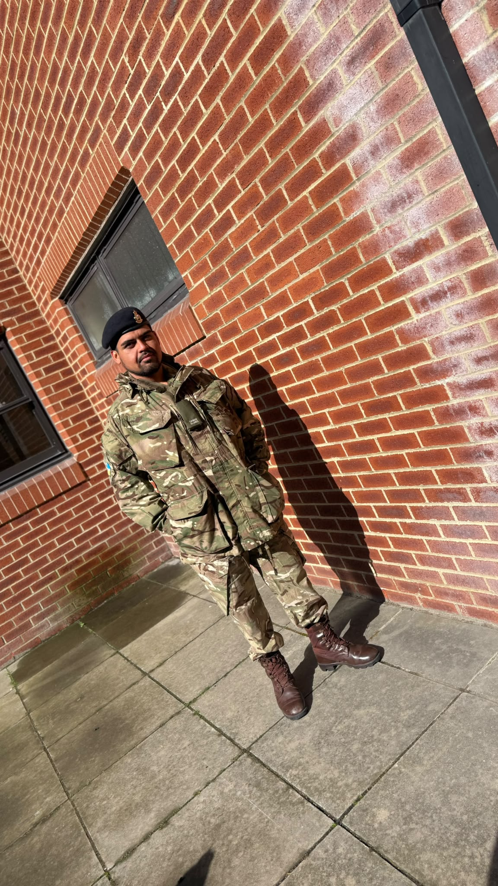

# Patrick Connerly

Patrick is a man of action. He excels in situations where civil order and critical infrastructure have broken down, and decisions need to be made quickly to restore stability and establish new systems.

He’s not the conventional corporate leader—and that’s precisely the point. The challenges facing healthcare are becoming increasingly complex. As cyberattacks and infrastructure failures become more disruptive, some healthcare organizations may find themselves rebuilding critical systems under intense pressure.

Patrick is the kind of leader who remains calm when others panic. He understands how to operate in high-pressure environments, make difficult decisions, and help teams restore essential services when every minute matters.

Those qualities are likely to become increasingly valuable in the security landscape ahead. As resilience becomes just as important as prevention, organizations will need leaders who can respond decisively, adapt rapidly, and guide people through uncertainty.
