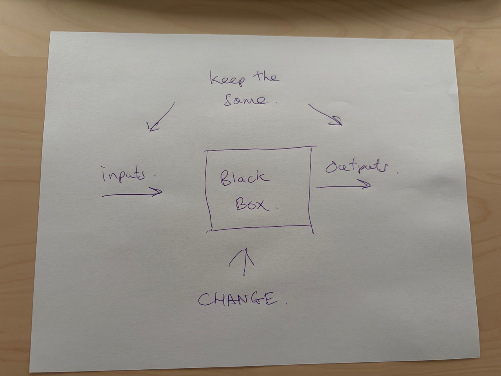

# Regression Testing

This is an old concept.  But if you can make this happen for a cost that approaches zero then
it's like in physics.

The rules will change.  Imagine a world where you could switch out interface engines automatically with almost no cost.

Suddenly it's going to be hard to make money selling an interface engine which is why I realized it wasn't such a bad career move to blow up mine and go become a pirate in the caribean making disruptive technologies like [new packaging technologies](../aazip/i.md).

