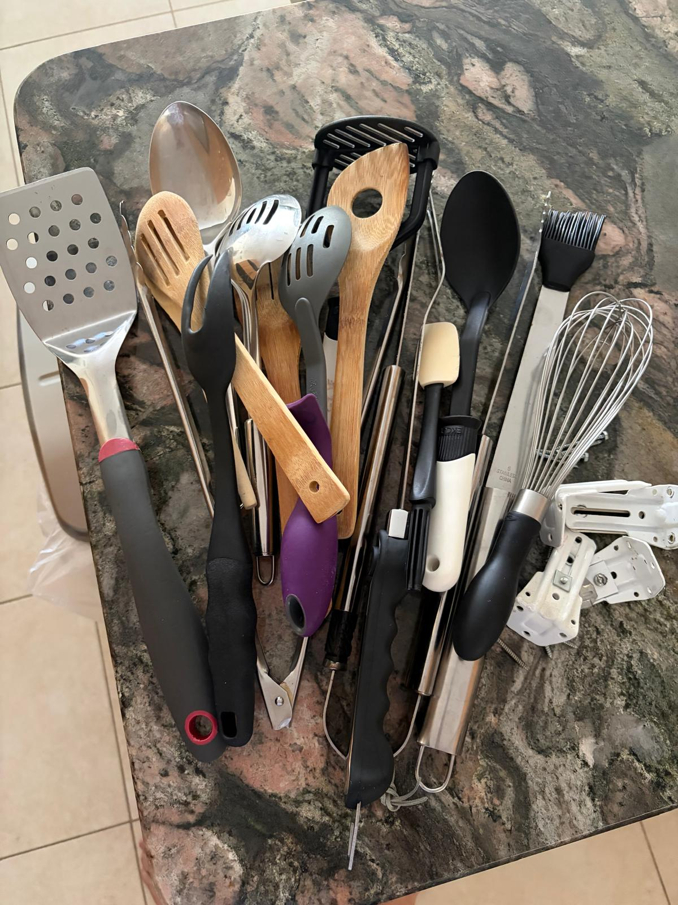
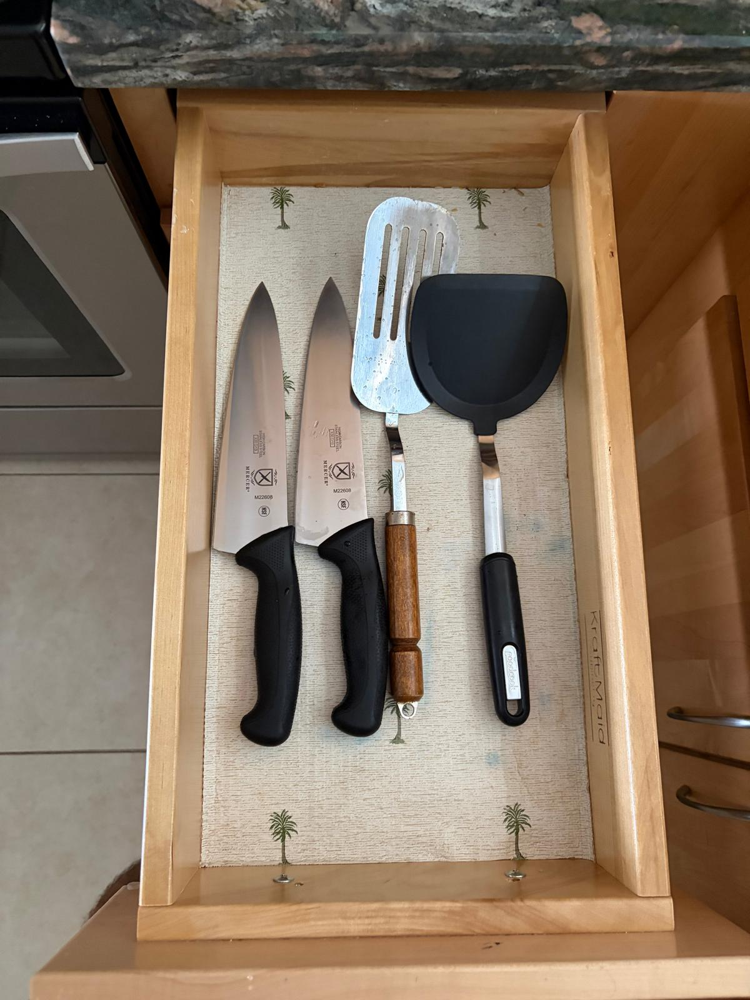

# System - Reduce Entropy 

It’s remarkable how universally true that the easiest way to reduce entropy in a system
is to remove unnecessary elements.

This is a fundamental concept I return to constantly. I’m currently staying somewhere safe, not because my own home is unsafe in any conventional sense — in fact, it feels remarkably secure — but because, ironically, it doesn’t feel safe at all right now.

And why is that? Well, abusers in society are notoriously allergic to accountability. It’s considered “rude” if you question them, especially if you ask those awkward, embarrassing questions — like, “Why did you choose to rape your sister?” (See [incest](/incest) for more on that uplifting topic.)

Anyway, in my current sanctuary, I’m decluttering. Removing things from my kitchen drawers that only make it harder to cook. If I discover I actually need something, I’ll fetch it from storage. For now, the result is bliss: drawers that open easily and contain only what I really use. Brackets, screws, and oversized tools that jam up the works? Not so great for stirring soup.

This is more functional:

The same principle applies beautifully to making stable, safe, and secure code. So much effort goes into explaining what *not* to use, but in the end, it’s worth it. Less really is more.

People too often overlook the obvious: just because something seems fun or convenient — say, sleeping with your sister or daughter — doesn’t mean it’s a good idea. Step back and look at the holistic, long-term picture. The psychological fallout is a bit harder to declutter.

One I remember Aunt Jackie who was a terrible hoarder. She was the sister of Judi Meade, the
mother of my ex wife Leanne Meade.  Incest and abuse can often run in families. I am so grateful
I personally escaped it.  It explains why all my serious mental health problems really started
quite late in my life - prior to then I had escaped major trauma.
